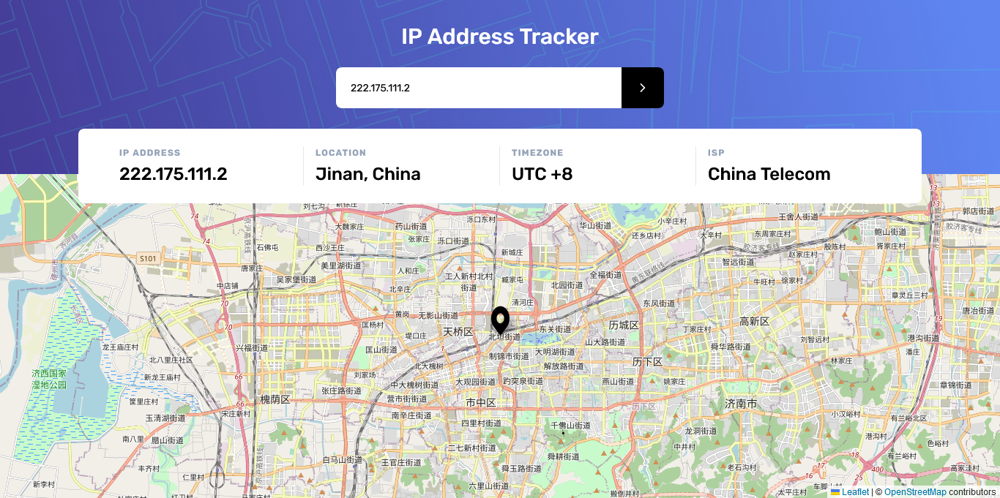

# Frontend Mentor - IP address tracker solution

This is a solution to the [IP address tracker challenge on Frontend Mentor](https://www.frontendmentor.io/challenges/ip-address-tracker-I8-0yYAH0). Frontend Mentor challenges help you improve your coding skills by building realistic projects.

## Overview

### Build with


### The challenge

Users should be able to:

- View the optimal layout for each page depending on their device's screen size
- See hover states for all interactive elements on the page
- See their own IP address on the map on the initial page load
- Search for any IP addresses or domains and see the key information and location

### Screenshot



### Links

Live Site URL: [Click here](https://your-live-site-url.com)

## How to use it

### Clone

```
git clone https://github.com/naufalf25/ip-address-tracker.git

npm install
```

### Start Development Environtment

Add .env.local to root folder

```
// .env.local

NEXT_PUBLIC_API_KEY={YOURAPIKEY}
```

get API KEY from [IP Geolocation API](https://ipgeolocation.io/) using your own account

Then you can start development server

```
npm run dev
```

open http://localhost:3000 into your browser

### Start Production Environtment

Add .env.local to root folder

```
// .env.local

NEXT_PUBLIC_API_KEY={YOURAPIKEY}
```

get API KEY from [IP Geolocation API](https://ipgeolocation.io/) using your own account

Then you can start production server

```
npm run build

// then

npm run start
```

open http://localhost:3000 into your browser

## Any Problems ?

Feel free to ask me via GitHub :D
